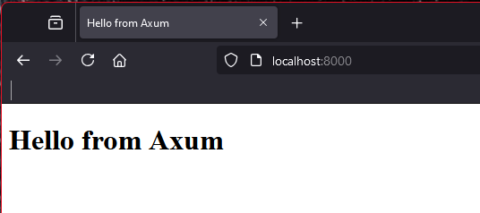

+++
title = "Serving the Web with Axum"
description = "An overview of how to get started with the Axum web framework"
date = "2024-08-21"
authors = ["Jeff Mitchell"]
draft = false
[taxonomies]
categories = ["How To"]
tags = ["server", "axum"]
+++

Today we dip a toe into the Axum web framework.

Axum is an unopinionated web application framework, written and maintained by the [Tokio](https://tokio.rs/) team. It’s very light and is built on top of the [hyper](https://hyper.rs/) HTTP library. Hyper reached a major milestone in November 2023, with it’s version 1.0 release. Axum was bumped to version 0.7 shortly after. The Tokio team wrote a [great blog post](https://tokio.rs/blog/2023-11-27-announcing-axum-0-7-0) explaining the major changes.

Alright, let’s get into some code…

```rust
// src/main.rs

// dependencies
use axum::{
    response::{Html, IntoResponse},
    routing::get,
    Router,
};
use std::net::SocketAddr;
>use tokio::net::TcpListener;

// root endpoint handler, sends back a "Hello from Axum!" message in HTML
async fn hello_from_axum() -> impl IntoResponse {
    Html(include_str!("assets/index.html"))
}

// main function, creates a Router type, attaches our handler to the "/" route
#[tokio::main]
async fn main() {
    // create an app, has the Router type, has one index route
    let app = Router::new().route("/", get(hello_from_axum));

    // create an address
    let addr = IpAddr::V4(Ipv4Addr::new(127, 0, 0, 1));

    // create a port
    let port: u16 = 8000;

    // create a socket to listen on
    let socket = SocketAddr::new(addr, port);

    // get a listener, use the socket we just created; the TcpListener::bind method could fail, so we use a match statement to handle that
   // we panic if we can't get a listener, there's no point in going any further
    let listener = match TcpListener::bind(&addr).await {
        Ok(tcp_listener) => tcp_listener,
        Err(err) => panic!("Could not get a TcpListener, {}", err),
    };

   // start up the server with our listener and the app; panics with an error message if the axum::serve function fails
    axum::serve(listener, app)
        .await
        .expect("Could not start up the axum server");
}

```

### Dependencies

First, we bring into scope several things from the axum crate itself:

- the `Html` type and `IntoResponse` trait, both from the response module
- the `get` method from the routing module, used to handle get requests
- the `Router` type, used to compose handlers and services
- the `SocketAddr` type from the standard library
- the `TcpListener` type from the Tokio crate

Axum relies on the Tokio crate for asyncronous operations, so be sure Tokio is added as a dependency in the Cargo.toml configuration file.

Let’s look at the main function first, then we’ll talk about the single handler function as part of that.

### Main Function

The general algorithm of our main function is:

- create an instance of our app; has one route at “/”, which accepts a get request and calls our `hello_from_axum` handler function
  - the `hello_from_axum` function takes no parameters, it simply returns some HTML created by reading in an `index.html` file using the `include_str!` macro
  - the `impl IntoResponse` return type indicates that we leverage the fact that Axum knows how to return an Html message without us writing any extra code, the IntoResponse trait is already implemented for the `Html` type
- create an address
- create a port
- use the address and port to create a socket
- create a listener, using the socket we just created, to listen for requests; there is some basic error handling here with a match statement, we panic if the attempt to get an address fails
- start up the server, using the `axum::serve` method, passing in the listener and app variables

Error handling is purposely left fairly basic. It’s generally not a good practice to panic and crash the program, but in this instance it makes sense. The application can’t run without an address to listen on or a listener to receive requests, so if these things fail there isn’t a lot of point in doing anything else.

That’s it!

If you typed everything in correctly, you can start up the basic server by typing:

```bash
cargo run
```

into your console. The server should start up and be listening on port 3000. If something happens error wise, you’ll see error messages returned at the console.

Head over to your web browser and type:

```bash
http://localhost:8000
```

You should be greeted with:



Pretty cool hey?

I know, not really. It’s pretty basic and not very interesting. Axum is terrific in its simplicity, but at the same time has much power and a great ecosystem. It really is garnering the mindshare of the Rust community and many projects appear to be standardizing around it. I bounced around between things for a long time, but have recently decided to just learn Axum properly.

There are a few warts on this simple server, chief of which is it doesn’t shut down very gracefully. I’ll show you how to do that in a future post.
