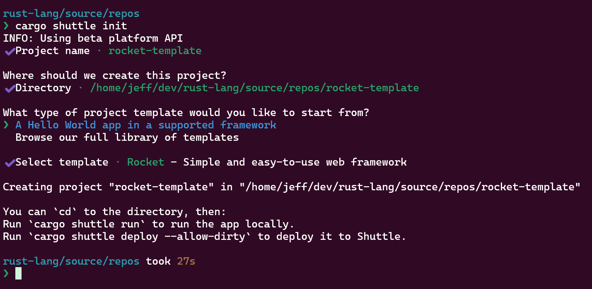
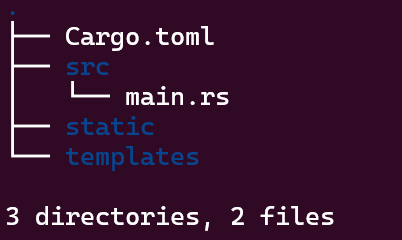
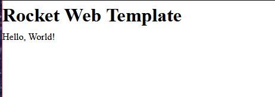

+++
title = "Serving the Web with Rocket"
description = "An article providing a starter for how to serve up templates and web content with Rocket."
date = "2024-09-15"
authors = ["Jeff Mitchell"]
draft = false
[taxonomies]
categories = ["How To"]
tags = ["rust", "web", "rocket", "templates", "static files"]
+++

## Introduction

I want to challenge the notion that it's difficult to do things with Rust. Yes, you have to learn the language, and yes, the learning curve is steep. However, I maintain that you don't have to be all the way up the learning curve to be productive.

Thanks to "batteries included" web frameworks like [Rocket](https://rocket.rs) it's quick to get started. In 30 minutes, at worst an hour, you can have a minimal web server together which let's you do server side rendering with templates. The served templates can be styled with CSS and livened with JavaScript, all with plain 'ol vanilla web tech.

Even better, you can host on [Shuttle's](https://shuttle.rs) Rust native development platform, which takes the heavy lifting away so you can focus on what you actually want to make.

Let's get this Rocket to the Vehicle Assembly Building.

## Getting Started

Head to where ever you save your coding projects on our own computer. First thing to do is install Shuttle. You can get the latest build for your operating system by following the [instructions](https://docs.shuttle.rs/getting-started/installation) on the Shuttle website.

At a command prompt, type:

```bash
cargo shuttle init
```

Follow the prompts by entering a project name, choosing the location, and picking a starting framework. Those steps will look like this:



I'm using the new beta Shuttle platform, but the steps are basically the same regardless. This will give you some basic boilerplate on which to build further.

## Adding a Health Check Route

Open your favourite code editor, and modify the code in `main.rs` to look like this:

```rust
// src/main.rs

// dependencies
use rocket::{get, routes, Build, Rocket};
use rocket::http::Status;

// function which returns a 200 OK response with empty body
#[get("/health")]
fn health() -> Status {
    Status::Ok
}

// function to create a rocket instance
fn create() -> Rocket<Build> {
    rocket::build()
        .mount("/api", routes![health])
}

// main function
#[shuttle_runtime::main]
async fn main() -> shuttle_rocket::ShuttleRocket {
    let rocket = create();

    Ok(rocket.into())
}
```

This code gives you a minimum Rocket server with one route at `/api/health`. This route has a handler function which responds with a 200 OK and empty body. This is a "health check" route that you can use in a basic way to poll if your server is running.

One aside to point out here, we have the routes created with a separate function called `create()` which takes no arguments and returns a Rocket instance configured with routes. We then call this `create()` function from our `main()` function. Separation like this facilitates testing, which I'll get into in the future.

## Serving Static Files

A web server needs to make assets available when routes are hit. With Rocket, an entire website can be served from the `/` index route by modifying our `main.rs` like so:

```rust
// src/main.rs

// dependencies
use rocket::{get, routes, Build, Rocket};
use rocket::fs::{relative, FileServer};
use rocket::http::Status;
use rocket_dyn_templates::{context, Template};

// function which returns a 200 OK response with empty body
#[get("/health")]
fn health() -> Status {
    Status::Ok
}

// function which returns the index page template
#[get("/")]
fn index() -> Template {
    let message = "Hello, World!";
    Template::render("index", context! { message })
}

// function to create a rocket instance
fn create() -> Rocket<Build> {
    rocket::build()
        .attach(Template::fairing())
        .mount("/", routes![index])
        .mount("/api", routes![health])
        .mount("/static", FileServer::from(relative!("static")))
        .mount("/assets", FileServer::from(relative!("assets")))
}

// main function
#[shuttle_runtime::main]
async fn main() -> shuttle_rocket::ShuttleRocket {
    let rocket = create();

    Ok(rocket.into())
}
```

I've gone ahead and added templating for Tera as well. You'll need to do `cargo add tera` to add the dependency to your `Cargo.toml` configuration. We pull in Rocket's `fs` module and leverage the `FileServer` method, passing it a relative path to the folder called 'static' which will live in the root of your project and serve as home to static assets. While you're at it, at the same level, create a folder called 'templates'. When done, your project directory tree should look like:



## Tera Templating

I sort of folded a couple of steps into one above, so let's talk about the templating step a little more. Rocket has super easy support for the [Tera](https://keats.github.io/tera/) templating engine, which is the one I've been focusing on lately. We add support for templating in general by pulling in `rocket_dyn_templates` as a dependency, specifically the `context!` macro and `Template` responder. In our `create()` function, we have to add a so-called "fairing", which automatically registers all available templates saved in the `/templates` folder in the project root.

We add a route and handler function which serves back the equivalent of `index.html`. We pass a message variable, via the `context!` macro with the text "Hello, World!" which will be rendered into the template at the location of our choice.

## Finishing Touches

There are a couple of last things to do, we need to actually have some templates. Create `base.tera.html` and `index.tera.html` in the templates folder, and give them the following content:

base.tera.html:

```html
<!DOCTYPE html>
<html lang="en">
  <head>
    <meta charset="UTF-8" />
    <meta name="viewport" content="width=device-width, initial-scale=1.0" />
    <link rel="preload" href="static/screen.css" as="style" />
    <link rel="preload" href="static/scripts.js" as="script" />
    <title>Rocket Web Template | Home</title>
    <link
      rel="stylesheet"
      type="text/css"
      href="static/screen.css"
      media="screen"
    />
    <link rel="icon" type="image/ico" href="static/favicon.ico" />
  </head>
  <body>
    <header>
      <h1>Rocket Web Template</h1>
    </header>
    <main></main>
    <script src="static/scripts.js"></script>
  </body>
</html>
```

index.tera.html:

```html
 
<section>{{ message }}</section>

```

### The Moment of Truth

With all these pieces in place:

```bash
cargo shuttle run
```

Once the Rocket web server launches, open your browser and navigate to `http://localhost:8000` and you should see served up in your browser:



Easy peasy!

From here, you can add more resources, routes, logic, whatever you need. Assets are served up from the `assets` folder and you can apply CSS styles and JavaScript as you traditionally would in a vanilla web tech site.

## Closing Thoughts

I think it's lazy to default to JavaScript for the backend when simple, easy to get started with solutions like Rocket exist. Yes, you have to know Rust, and that can be a blocker, but you don't have to know _that_ much Rust. You sure won't be forced into dealing with lifetimes and all the higher order concepts alone. Rocket takes care of many things for you and quite simply just gets out of your way.

Think about it, for your next project.

## References

[The Rocket Programming Guide](https://rocket.rs/guide/v0.5/)
[Tera Template Engine for Rust](https://keats.github.io/tera/)
